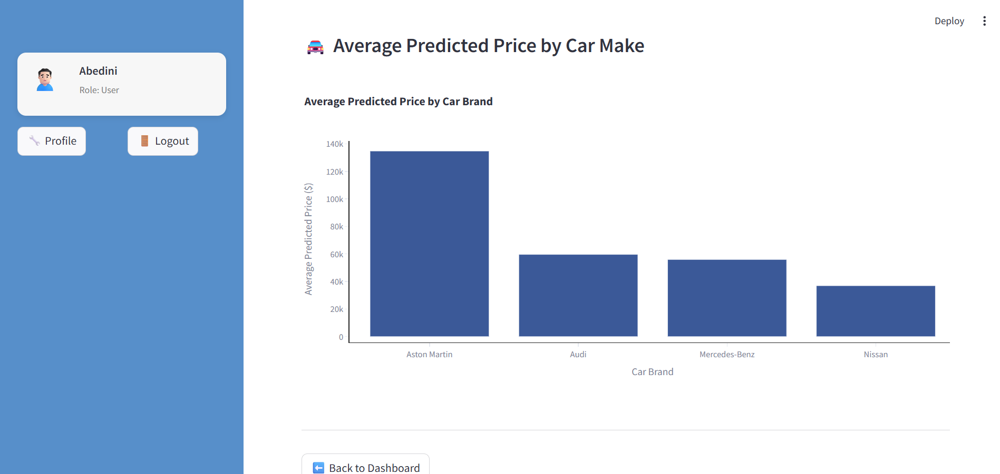

# Car Price Prediction Dashboard

An interactive web application built with **Python** and **Streamlit** that predicts car prices using a trained **machine learning model**. Users can input car details, get a predicted price, and track their prediction history — all in a simple and accessible online interface.


---

## Project Overview

This project combines web scraping, data preprocessing, model training, and frontend development into a complete machine learning application. The goal is to allow users (with or without technical background) to estimate car prices based on specifications like brand, mileage, year, and more.

---

## Features

- Machine Learning model trained on real-world scraped data  
- User registration, login & role-based access (admin / user)  
- Interactive price prediction dashboard with input sliders & dropdowns  
- Personalized profile page with:
  - Prediction history table
  - CSV download option
  - Trend analysis chart
  - Average predicted price by brand

---

## UI

### Dashboard Interface  


### User Profile & Charts 




### Login/Registration


---

## Tech Stack

| Component           | Technology           |
|--------------------|----------------------|
| Web Framework       | Streamlit            |
| Data Handling       | Pandas, NumPy        |
| ML Model            | Scikit-learn         |
| Data Visualization  | Plotly, Seaborn      |
| Web Scraping        | BeautifulSoup, Requests |
| Authentication      | JSON-based auth      |
| Storage             | JSON, Pickle         |

---

## Project Structure

```bash
├── app.py                     # Streamlit dashboard logic
├── main.py                    # Streamlit router for navigation
├── model.ipynb                # ML model training and evaluation
├── WebScraping.ipynb          # Car data web scraping
├── login_utils.py             # Auth/session logic
├── auth.py                    # Admin tools (register/remove users)
├── profile_page.py            # User dashboard and charts
├── user_panel.py              # CLI-based admin/user panel
├── users.json                 # Saved user info
├── current_user.json          # Logged-in user info
├── prediction_history.json    # Prediction history logs
├── model.pkl                  # Trained ML model
```

## Model Performance
- **R² Score**: 0.91 — Strong correlation between inputs and predicted price
- **MAE**: ≈ 2,000 USD — On average, the model’s prediction is off by this much
- **MSE**: ≈ 7,000,000 — Low squared error, confirming good accuracy
- **Feature Importance**: The most impactful features were Year, Make, and Mileage.

## Authentication
The app supports basic authentication with JSON-based storage.

- **User Role**:
  - Can make predictions
  - View personal prediction history
- **Admin Role**:
  - Manage users via CLI (add/remove)
  - See full user list
- **Default role during registration**: user

## Getting Started

1. **Clone the Repository**
   ```bash
   git clone https://github.com/your-username/car-price-predictor.git
   cd car-price-predictor
   ```

2. **Install Dependencies**

3. **Run the Streamlit App**
   ```bash
   streamlit run main.py
   ```

## TODOs / Improvements
- Encrypt passwords with hashing
- Replace JSON files with SQLite or ...
